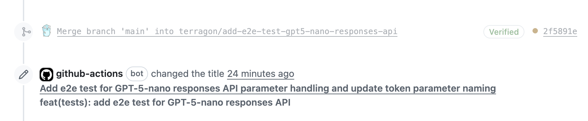

# action-auto-semantic-pull-request

> ## 🎉 **COMPLETELY FREE TO USE** 🎉
>
> **No credit card • No subscription • No hidden costs**
>
> Get your **FREE API key** in 30 seconds at [llmgateway.io](https://llmgateway.io) and start using AI-powered semantic PR titles immediately!

**🤖 AI-Powered Fork**: This is a fork of [action-semantic-pull-request](https://github.com/amannn/action-semantic-pull-request) that **automatically generates semantic pull request titles using AI completions**.

**Why this is better:**
- ✅ **100% FREE** - Uses free models by default
- 🚀 **Zero setup friction** - Get API key without credit card at [llmgateway.io](https://llmgateway.io)
- 🤖 **Smart AI generation** - Automatically fixes non-semantic PR titles
- 🔧 **Fully configurable** - Works with any OpenAI-compatible API

This GitHub Action ensures that your pull request titles match the [Conventional Commits spec](https://www.conventionalcommits.org/) by automatically generating appropriate titles when they don't conform to the standard. When a PR title doesn't follow conventional commits format, the action uses AI to analyze the PR content and automatically set a properly formatted semantic title. Typically, this is used in combination with a tool like [semantic-release](https://github.com/semantic-release/semantic-release) to automate releases.

Used by: [Electron](https://github.com/electron/electron) · [Vite](https://github.com/vitejs/vite) · [Excalidraw](https://github.com/excalidraw/excalidraw) · [Apache](https://github.com/apache/pulsar) · [Vercel](https://github.com/vercel/ncc) · [Microsoft](https://github.com/microsoft/SynapseML) · [Firebase](https://github.com/firebase/flutterfire) · [AWS](https://github.com/aws-ia/terraform-aws-eks-blueprints) – and [many more](https://github.com/amannn/action-semantic-pull-request/network/dependents).

## Examples

> ### 🆓 **FREE AI Magic in Action!**
>
> **No manual work needed** - just create your PR and watch the AI automatically fix the title!



**🤖 AI Auto-Generation Examples:**

When you create a PR with a non-semantic title like "Update login functionality", the **FREE AI** will analyze your changes and automatically convert it to:
- `feat(auth): Add support for OAuth 2.0 authentication`

Or if you submit "Bug fixes" as the title, it might become:
- `fix: Resolve memory leak in user session handling`

**✅ All these transformations happen automatically with the FREE llama model!**

**Valid pull request titles:**
- fix: Correct typo
- feat: Add support for Node.js 18
- refactor!: Drop support for Node.js 12
- feat(ui): Add `Button` component

> Note that since pull request titles only have a single line, you have to use `!` to indicate breaking changes.

See [Conventional Commits](https://www.conventionalcommits.org/) for more examples.

## Installation

### 🆓 **Step 1: Get Your FREE API Key** (30 seconds!)

1. **Go to [llmgateway.io](https://llmgateway.io)**
2. **Sign up with just your email** - **NO credit card required!**
3. **Copy your API key** - it's generated instantly
4. **That's it!** You now have access to free AI completions

### 🔧 **Step 2: Add to Your Repository**

1. **Add your FREE API key to GitHub secrets:**
   - Go to your repository → **Settings** → **Secrets and variables** → **Actions**
   - Click **"New repository secret"**
   - Name: `AI_API_KEY`
   - Value: Paste your free API key from llmgateway.io
   - Click **"Add secret"**

2. **Create the workflow file:**
   - If your goal is to create squashed commits that will be used for automated releases, you'll want to configure your GitHub repository to [use the squash & merge strategy](https://docs.github.com/en/repositories/configuring-branches-and-merges-in-your-repository/configuring-pull-request-merges/configuring-commit-squashing-for-pull-requests) and tick the option "Default to PR title for squash merge commits"
   - [Add the action](https://docs.github.com/en/actions/quickstart) with the following configuration:
```yml
name: "Auto Semantic PR"

on:
  pull_request_target:
    types:
      - opened
      - edited
      - reopened

jobs:
  main:
    name: Validate and auto-fix PR title
    runs-on: ubuntu-latest
    permissions:
      pull-requests: write  # Required for AI title generation
    steps:
      - uses: steebchen/action-auto-semantic-pull-request@main
        env:
          GITHUB_TOKEN: ${{ secrets.GITHUB_TOKEN }}
        with:
          aiApiKey: ${{ secrets.AI_API_KEY }}  # Required for AI title generation
```

> ### 🎊 **Congratulations! You're Done!**
>
> Your repository now has **FREE AI-powered semantic PR titles**!
>
> Just create a PR with any title and watch the magic happen! ✨

See the [event triggers documentation](#event-triggers) below to learn more about what `pull_request_target` means.

### 🔧 Advanced Configuration (Optional)

> **💡 The setup above is all you need!** The sections below are only for advanced customization.

**Already using the action? Here's how AI title generation works:**

1. **✅ FREE by default** - Uses `llama-3.3-70b-instruct-free` model at no cost
2. **🆓 Powered by [llmgateway.io](https://llmgateway.io)** - No credit card required
3. **🤖 Smart analysis** - Looks at your PR description, commits, and file changes
4. **⚡ Instant results** - Automatically updates your PR title in seconds

**Want to customize?** You can:
- **Use different models** - Try `gpt-4o-mini` (paid) for different results
- **Use different providers** - OpenAI, Azure OpenAI, or any OpenAI-compatible API (paid)
- **Configure base URLs** - Point to your own AI service

When a pull request title doesn't conform to conventional commits format, the action will:
1. Analyze the PR description, commit messages, and file changes
2. Generate an appropriate semantic title using AI
3. Automatically update the PR title
4. Continue with normal validation

> **💡 Pro Tip**: This action is completely FREE to use! The default configuration uses the free `llama-3.3-70b-instruct-free` model on llmgateway.io, which provides excellent results without any cost.

## Configuration

The action works without configuration, however you can provide options for customization.

The following terminology helps to understand the configuration options:

```
feat(ui): Add `Button` component
^    ^    ^
|    |    |__ Subject
|    |_______ Scope
|____________ Type
```

```yml
        with:
          # API key for AI completions (required for AI title generation)
          aiApiKey: ${{ secrets.AI_API_KEY }}
          # Enable/disable AI title generation (default: true if aiApiKey is provided)
          aiTitleGeneration: true
          # Custom AI API base URL (default: https://api.llmgateway.io)
          # For OpenAI directly: https://api.openai.com
          # For Azure OpenAI: https://your-resource.openai.azure.com
          aiBaseUrl: https://api.llmgateway.io
          # AI model to use (default: llama-3.3-70b-instruct-free - FREE!)
          # FREE models on llmgateway.io: llama-3.3-70b-instruct-free (recommended)
          # Paid models: see all on https://llmgateway.io/models
          aiModel: llama-3.3-70b-instruct-free
          # Configure which types are allowed (newline-delimited).
          # Default: https://github.com/commitizen/conventional-commit-types
          types: |
            fix
            feat
          # Configure which scopes are allowed (newline-delimited).
          # These are regex patterns auto-wrapped in `^ $`.
          scopes: |
            core
            ui
            JIRA-\d+
          # Configure that a scope must always be provided.
          requireScope: true
          # Configure which scopes are disallowed in PR titles (newline-delimited).
          # For instance by setting the value below, `chore(release): ...` (lowercase)
          # and `ci(e2e,release): ...` (unknown scope) will be rejected.
          # These are regex patterns auto-wrapped in `^ $`.
          disallowScopes: |
            release
            [A-Z]+
          # Configure additional validation for the subject based on a regex.
          # This example ensures the subject doesn't start with an uppercase character.
          subjectPattern: ^(?![A-Z]).+$
          # If `subjectPattern` is configured, you can use this property to override
          # the default error message that is shown when the pattern doesn't match.
          # The variables `subject` and `title` can be used within the message.
          subjectPatternError: |
            The subject "{subject}" found in the pull request title "{title}"
            didn't match the configured pattern. Please ensure that the subject
            doesn't start with an uppercase character.
          # The GitHub base URL will be automatically set to the correct value from the GitHub context variable.
          # If you want to override this, you can do so here (not recommended).
          githubBaseUrl: https://github.myorg.com/api/v3
          # If the PR contains one of these newline-delimited labels, the
          # validation is skipped. If you want to rerun the validation when
          # labels change, you might want to use the `labeled` and `unlabeled`
          # event triggers in your workflow.
          ignoreLabels: |
            bot
            ignore-semantic-pull-request
          # If you're using a format for the PR title that differs from the traditional Conventional
          # Commits spec, you can use these options to customize the parsing of the type, scope and
          # subject. The `headerPattern` should contain a regex where the capturing groups in parentheses
          # correspond to the parts listed in `headerPatternCorrespondence`.
          # See: https://github.com/conventional-changelog/conventional-changelog/tree/master/packages/conventional-commits-parser#headerpattern
          headerPattern: '^(\w*)(?:\(([\w$.\-*/ ]*)\))?: (.*)$'
          headerPatternCorrespondence: type, scope, subject
```

### Work-in-progress pull requests

For work-in-progress PRs you can typically use [draft pull requests from GitHub](https://github.blog/2019-02-14-introducing-draft-pull-requests/). However, private repositories on the free plan don't have this option and therefore this action allows you to opt-in to using the special "[WIP]" prefix to indicate this state.

**Example:**

```
[WIP] feat: Add support for Node.js 18
```

This will prevent the PR title from being validated, and pull request checks will remain pending.

**Attention**: If you want to use the this feature, you need to grant the `pull-requests: write` permission to the GitHub Action. This is because the action will update the status of the PR to remain in a pending state while `[WIP]` is present in the PR title.

```yml
name: "Lint PR"

permissions:
  pull-requests: write

jobs:
  main:
    name: Validate PR title
    runs-on: ubuntu-latest
    permissions:
      pull-requests: read
    steps:
      - uses: steebchen/action-auto-semantic-pull-request@main
        env:
          GITHUB_TOKEN: ${{ secrets.GITHUB_TOKEN }}
        with:
          aiApiKey: ${{ secrets.AI_API_KEY }}
          wip: true
```

### Legacy configuration for validating single commits

When using "Squash and merge" on a PR with only one commit, GitHub will suggest using that commit message instead of the PR title for the merge commit. As it's easy to commit this by mistake this action supports two configuration options to provide additional validation for this case.

```yml
          # If the PR only contains a single commit, the action will validate that
          # it matches the configured pattern.
          validateSingleCommit: true
          # Related to `validateSingleCommit` you can opt-in to validate that the PR
          # title matches a single commit to avoid confusion.
          validateSingleCommitMatchesPrTitle: true
```

However, [GitHub has introduced an option to streamline this behaviour](https://github.blog/changelog/2022-05-11-default-to-pr-titles-for-squash-merge-commit-messages/), so using that instead should be preferred.

## Event triggers

There are two events that can be used as triggers for this action, each with different characteristics:

1. [`pull_request_target`](https://docs.github.com/en/actions/reference/events-that-trigger-workflows#pull_request_target): This allows the action to be used in a fork-based workflow, where e.g. you want to accept pull requests in a public repository. In this case, the configuration from the main branch of your repository will be used for the check. This means that you need to have this configuration in the main branch for the action to run at all (e.g. it won't run within a PR that adds the action initially). Also if you change the configuration in a PR, the changes will not be reflected for the current PR – only subsequent ones after the changes are in the main branch.
2. [`pull_request`](https://docs.github.com/en/actions/reference/events-that-trigger-workflows#pull_request): This configuration uses the latest configuration that is available in the current branch. It will only work if the branch is based in the repository itself. If this configuration is used and a pull request from a fork is opened, you'll encounter an error as the GitHub token environment parameter is not available. This option is viable if all contributors have write access to the repository.

## Outputs

- The outputs `type`, `scope` and `subject` are populated, except for if the `wip` option is used.
- The `error_message` output will be populated in case the validation fails.

[An output can be used in other steps](https://docs.github.com/en/actions/using-jobs/defining-outputs-for-jobs), for example to comment the error message onto the pull request.

<details>
<summary>Example</summary>

```yml
name: "Lint PR"

on:
  pull_request_target:
    types:
      - opened
      - edited

permissions:
  pull-requests: write

jobs:
  main:
    name: Validate PR title
    runs-on: ubuntu-latest
    permissions:
      pull-requests: read
    steps:
      - uses: steebchen/action-auto-semantic-pull-request@main
        id: lint_pr_title
        env:
          GITHUB_TOKEN: ${{ secrets.GITHUB_TOKEN }}
        with:
          aiApiKey: ${{ secrets.AI_API_KEY }}

      - uses: marocchino/sticky-pull-request-comment@v2
        # When the previous steps fails, the workflow would stop. By adding this
        # condition you can continue the execution with the populated error message.
        if: always() && (steps.lint_pr_title.outputs.error_message != null)
        with:
          header: pr-title-lint-error
          message: |
            Hey there and thank you for opening this pull request! 👋🏼

            We require pull request titles to follow the [Conventional Commits specification](https://www.conventionalcommits.org/en/v1.0.0/) and it looks like your proposed title needs to be adjusted.

            Details:

            ```
            ${{ steps.lint_pr_title.outputs.error_message }}
            ```

      # Delete a previous comment when the issue has been resolved
      - if: ${{ steps.lint_pr_title.outputs.error_message == null }}
        uses: marocchino/sticky-pull-request-comment@v2
        with:
          header: pr-title-lint-error
          delete: true
```

</details>
